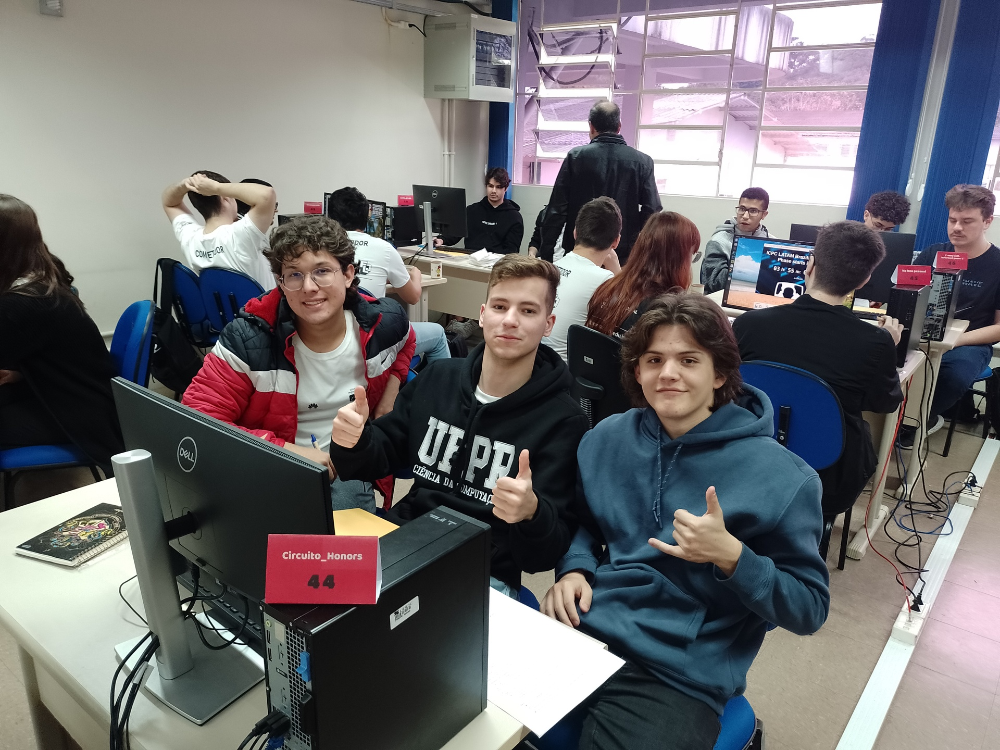

# Competitive-Programming
## Antonio da Ressurreição Filho, student in the third semester of Computer Science at the Federal University of Paraná (UFPR).

## Members of my team: [Nathaendo](https://github.com/Nathaendo) and [ArthurDDev](https://github.com/ArthurDDev) 

# Português:

## [LINK DO MEU PERFIL NO BEECROWD](https://judge.beecrowd.com/pt/profile/930291)
## [LINK DO MEU PERFIL NO CODEFORCES](https://codeforces.com/profile/Toninhorf)

O BeeCrowd e o CodeForces são plataformas que oferecem exercícios de programação, projetados como desafios ou problemas computacionais para testar e aprimorar habilidades relacionadas às maratonas de programação. 
Essas maratonas fazem parte de uma área da computação conhecida como **programação competitiva**, amplamente reconhecida e valorizada pelas maiores empresas do mundo, como o Google, que organiza sua 
própria competição anualmente.

Nesse repositório, há diversos exercícios resolvidos por mim nas linguagens C++ e Python, em suas respectivas pastas.

***IMPORTANTE:*** Esse repositório será atualizado de tempos em tempos, conforme eu for resolvendo mais e mais exercícios presentes nas plataformas, a fim de eu melhorar cada vez mais minhas habilidades no
meio da programação. Então, esse repositório é um projeto duradouro que pretendo levar até o fim da minha graduação em Ciência da Computação.

# English:

## [LINK OF MY PROFILE ON BEECROWD](https://judge.beecrowd.com/pt/profile/930291)
## [LINK OF MY PROFILE ON CODEFORCES](https://codeforces.com/profile/Toninhorf)

BeeCrowd and CodeForces are platforms that offers programming exercises designed as challenges or computational problems to test and improve skills related to programming marathons.  
These marathons are part of a field of computing known as **competitive programming**, widely recognized and valued by the world's largest companies, such as Google, which organizes its own competition annually.

In this repository, there are several exercises solved by me in C++ and Python, each in their respective folders.

***IMPORTANT:*** This repository will be updated from time to time as I solve more and more exercises available on the platforms, aiming to continuously improve my programming skills.  
Therefore, this repository is a long-term project that I intend to maintain until the end of my Computer Science degree.
